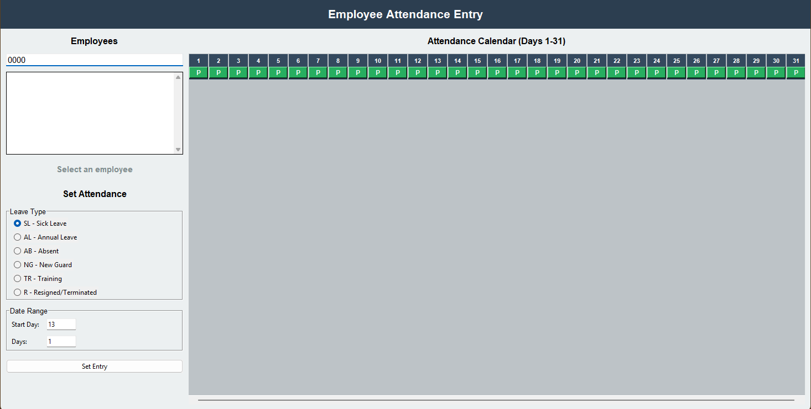
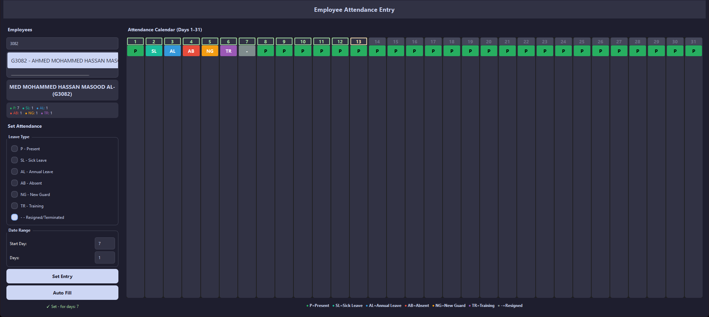

# Employee Attendance Tracker




A desktop application for managing employee attendance records using Excel.

## Features

- **Employee Management**: Browse and search employees by ID or name
- **Attendance Tracking**: Mark daily attendance with leave types
- **Leave Types**: SL (Sick Leave), AL (Annual Leave), AB (Absent), NG (New Guard), TR (Training), R (Resigned/Terminated)
- **Calendar View**: Visual 31-day calendar showing attendance status
- **Batch Entry**: Set attendance for multiple consecutive days

## Requirements

```
pandas
openpyxl
```

Install dependencies:
```bash
pip install -r requirements.txt
```

## Usage

1. Ensure `data.xlsx` exists in the project folder with employee data
2. Run the application:
   ```bash
   python app.py
   ```
3. Select an employee from the list
4. Choose leave type and date range
5. Click "Set Entry" to save

## Data Format

The application reads from `data.xlsx` (Sheet1):
- Column B: Employee ID (starts with "G")
- Column C: Employee Name
- Columns G-AH: Days 1-31

## License

MIT
